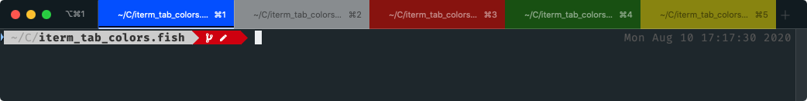

# iterm_tab_colors.fish
Automatically differentiate your [iterm2](https://www.iterm2.com) tabs with colors.



_In this image, the blue tab is brighter because it's the active tab._

## Installation
First, make sure you have iterm2 shell integration with utilities installed. See [this page](https://www.iterm2.com/documentation-shell-integration.html) for instructions. If you can execute `it2setcolor`, then you are good to go.

Secondly, install the fish plugin itself.

with [fisher](https://github.com/jorgebucaran/fisher)
```
fisher add patrickf3139/iterm_tab_colors.fish
```

or with [Oh My Fish](https://github.com/oh-my-fish/oh-my-fish)
```fish
omf install https://github.com/patrickf3139/iterm_tab_colors.fish
```
